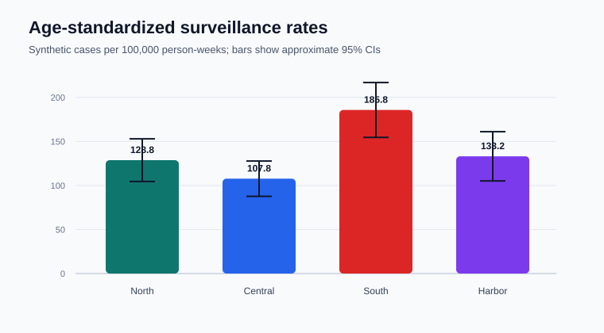
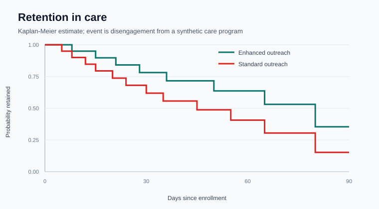

# Public Health Methods Lab

[](https://github.com/mjeans/mjeans/actions/workflows/validate-public-health-lab.yml)

A compact, reproducible portfolio of epidemiology and biostatistics methods applied to deterministic synthetic data. The lab follows a hypothetical respiratory-disease surveillance and community-care scenario from descriptive surveillance through comparative measures and time-to-event analysis.

> No patient, participant, or protected health information is included. Every value is synthetic and exists only to demonstrate analytic practice.

## Questions demonstrated

1. How do district case rates compare after direct age standardization?
2. Does a weekly count cross a transparent rolling surveillance threshold?
3. What is the attack-rate ratio for a suspected outbreak exposure?
4. How does time retained in care differ between two outreach groups when observations are right-censored?

## Results at a glance



The synthetic South district has the highest age-standardized rate. Standardization changes the comparison from one driven partly by different age structures to one based on a common reference population. Approximate Poisson confidence intervals keep sampling uncertainty visible.



The synthetic enhanced-outreach group remains in care longer in the descriptive Kaplan-Meier analysis. Because group assignment is not randomized and the sample is constructed for demonstration, this is not a causal effect estimate.

The complete deterministic findings are in [the generated summary](outputs/summary.md).

## Methods

| Domain | Implementation | Reviewable output |
|---|---|---|
| Public-health surveillance | Crude rates, direct age standardization, rolling z-score signal | `age_standardized_rates.csv`, `weekly_surveillance_signals.csv` |
| Epidemiology | Attack rates, risk ratio, log-scale 95% CI | `outbreak_risk_ratio.csv` |
| Biostatistics | Kaplan-Meier estimation, right-censoring, Greenwood log-log CI, median event time | `retention_curve.csv` |
| Reproducibility | Dependency-free Python, deterministic fixtures, regression tests, GitHub Actions | workflow badge and tests |

The formulas, estimands, and interpretation limits are documented in [Methods and assumptions](docs/methods.md).

## Repository map

```text
public-health-methods-lab/
  src/            Inspectable statistical functions
  scripts/        Deterministic analysis and figure generation
  tests/          Unit and regression tests
  outputs/        Reproducible tables and narrative summary
  assets/         Reproducibly generated SVG figures
  docs/           Methods, assumptions, and interpretation boundaries
  data/           Data-governance note; no row-level health data
```

## Run the lab

Python 3.11 or later is the only requirement.

```bash
python public-health-methods-lab/tests/test_methods.py
python public-health-methods-lab/scripts/run_analysis.py
```

The GitHub Actions workflow runs the tests, rebuilds every output, and fails if the committed reference results drift.

## Responsible interpretation

This lab demonstrates statistical implementation under known synthetic conditions. A real analysis would require a protocol, data provenance review, case-definition governance, missingness assessment, small-cell rules, privacy review, appropriate surveillance methods, design-aware inference, and subject-matter interpretation. Statistical associations and alert thresholds do not identify causes on their own.
